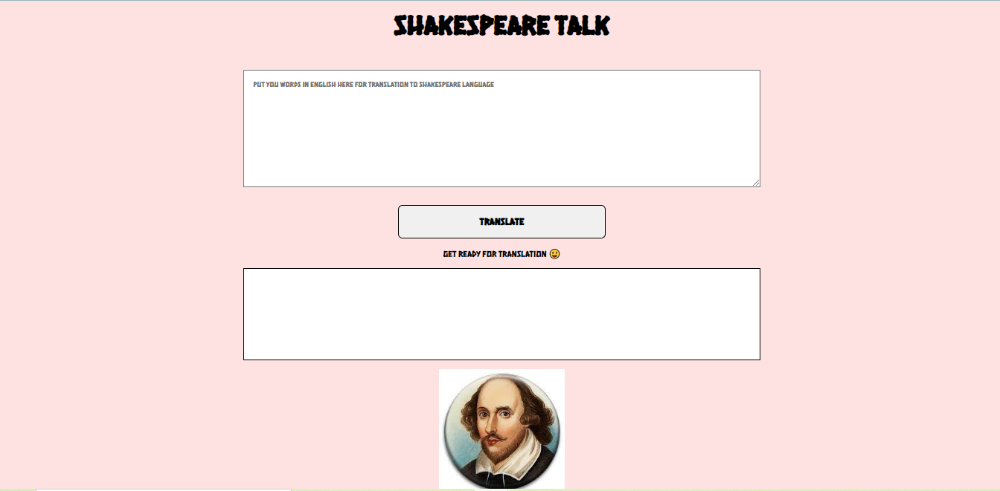

# "Shakespeare speak app"

Tech stack:
This app is made using vanilla js.

About project:
This project was made as part of level zero of neogcamp.

"Shakespeare speak app" takes input as text in english from user and translates it to Shakespeare language.

Used shakespeare funtranslation api for the web app.

CLI app look:

